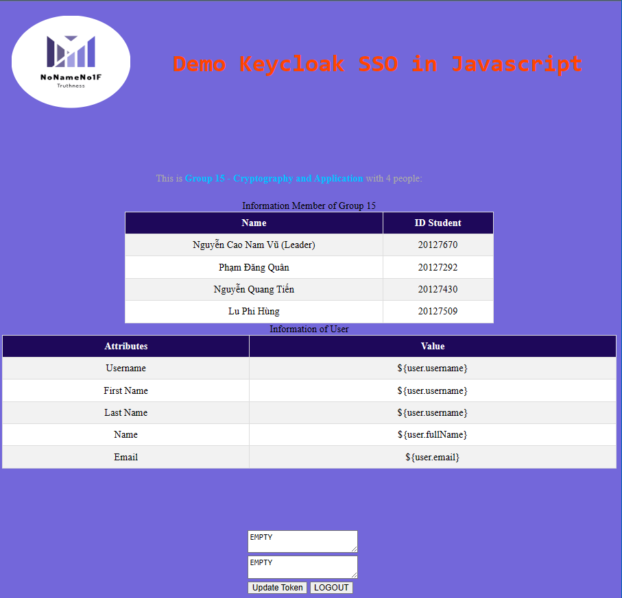

<!--
Hey, thanks for using the awesome-readme-template template.
If you have any enhancements, then fork this project and create a pull request
or just open an issue with the label "enhancement".

Don't forget to give this project a star for additional support ;)
Maybe you can mention me or this repo in the acknowledgements too
-->
<div align="center">

  
  <h1>Keycloak-SSO-with-JS-Application</h1>
  
  <p>
    Keycloak is an Open Source Identity and Access Management solution for modern Applications and Services.

    This repository contains the source code for the Keycloak Javascript.js adapter. This module makes it simple to implement a Javascript.js Connect-friendly application that uses Keycloak for its authentication and authorization needs.

  </p>

  <p>
    Demo Single Sign-On by using Keycloak into Javascript Application 
  </p>
  
  
<!-- Badges -->
<p>
  <a href="https://github.com/NoNameNo1F/Keycloak-SSO-with-JS-Application/graphs/contributors">
    
  </a>
  <a href="">
    
  </a>
  <a href="https://github.com/NoNameNo1F/Keycloak-SSO-with-JS-Application/network/members">
    
  </a>
  <a href="https://github.com/NoNameNo1F/Keycloak-SSO-with-JS-Application/stargazers">
    
  </a>
  <a href="https://github.com/NoNameNo1F/Keycloak-SSO-with-JS-Application/issues/">
    
  </a>
  <a href="https://github.com/NoNameNo1F/Keycloak-SSO-with-JS-Application/blob/master/LICENSE">
    
  </a>
</p>
   
<h4>
    <a href="https://github.com/NoNameNo1F/Keycloak-SSO-with-JS-Application/">View Demo</a>
  <span> · </span>
    <a href="https://github.com/NoNameNo1F/Keycloak-SSO-with-JS-Application/">Documentation</a>
  <span> · </span>
    <a href="https://github.com/NoNameNo1F/Keycloak-SSO-with-JS-Application/issues/">Report Bug</a>
  <span> · </span>
    <a href="https://github.com/NoNameNo1F/Keycloak-SSO-with-JS-Application/issues/">Request Feature</a>
  </h4>
</div>

<br />

<!-- Table of Contents -->

# :notebook_with_decorative_cover: Table of Contents

- [About the Project](#star2-about-the-project)
  - [Screenshots](#camera-screenshots)
  - [Tech Stack](#space_invader-tech-stack)
  - [Features](#dart-features)
  - [Color Reference](#art-color-reference)
  - [Environment Variables](#key-environment-variables)
- [Getting Started](#toolbox-getting-started)
  - [Prerequisites](#bangbang-prerequisites)
  - [Installation](#gear-installation)
  - [Running Tests](#test_tube-running-tests)
  - [Run Locally](#running-run-locally)
  - [Deployment](#triangular_flag_on_post-deployment)
- [Usage](#eyes-usage)
- [Roadmap](#compass-roadmap)
- [Contributing](#wave-contributing)
  - [Code of Conduct](#scroll-code-of-conduct)
- [FAQ](#grey_question-faq)
- [License](#warning-license)
- [Contact](#handshake-contact)
- [Acknowledgements](#gem-acknowledgements)

<!-- About the Project -->

## :star2: About the Project

<!-- Screenshots -->

### :camera: Screenshots

<div align="center"> 
  
</div>

<!-- TechStack -->

### :space_invader: Tech Stack

<details>
  <summary>Client</summary>
  <ul>
    <li><a href="https://js.org/">Javascript</a></li>
  </ul>
</details>

<details>
  <summary>Server</summary>
  <ul>
    <li><a href="https://openjdk.org/">OpenJDK</a></li>
    <li><a href="https://expressjs.com/">Express.js</a></li>
    <li><a href="https://keycloak.org">Keycloak</a></li>
  </ul>
</details>

<details>
<summary>Database</summary>
</details>

<details>
<summary>DevOps</summary>
  <ul>
    <li><a href="https://www.docker.com/">Docker</a></li>
  </ul>
</details>

<!-- Features -->

### :dart: Features

- Login/Logout

<!-- Color Reference -->

### :art: Color Reference

| Color           | Hex                                                              |
| --------------- | ---------------------------------------------------------------- |
| Primary Color   |  #222831 |
| Secondary Color |  #393E46 |
| Accent Color    |  #00ADB5 |
| Text Color      |  #EEEEEE |

<!-- Env Variables -->

### :key: Environment Variables

To run this project, you will need to add the following environment variables to your .env file

`API_KEY`

`ANOTHER_API_KEY`

<!-- Getting Started -->

## :toolbox: Getting Started

<!-- Prerequisites -->

### :bangbang: Prerequisites

This project uses Yarn as package manager

```bash
 npm install --global yarn
```

<!-- Installation -->

### :gear: Installation

Install my-project with npm

```bash
  npm install my-project
  cd my-project
```

<!-- Running Tests -->

### :test_tube: Running Tests

To run tests, run the following command

```bash
  yarn test test
```

<!-- Run Locally -->

### :running: Run Locally

Clone the project

```bash
  git clone https://github.com/NoNameNo1F/Keycloak-SSO-with-JS-Application.git
```

Go to the project directory

```bash
  cd Keycloak-SSO-with-JS-Application
```

Install dependencies

```bash
  npm install
```

Start the server

```bash
  npm start
```

<!-- Deployment -->

### :triangular_flag_on_post: Deployment

To deploy this project run

```bash
  yarn deploy
```

<!-- Usage -->

## :eyes: Usage

Use this space to tell a little more about your project and how it can be used. Show additional screenshots, code samples, demos or link to other resources.

```javascript
import Component from "my-project";

function App() {
  return <Component />;
}
```

<!-- Roadmap -->

## :compass: Roadmap

- [x] Todo 1
- [ ] Todo 2

<!-- Contributing -->

## :wave: Contributing

<a href="https://github.com/NoNameNo1F/Keycloak-SSO-with-JS-Application/graphs/contributors">
  
</a>

Contributions are always welcome!

See `contributing.md` for ways to get started.

<!-- Code of Conduct -->

### :scroll: Code of Conduct

Please read the [Code of Conduct](https://github.com/NoNameNo1F/Keycloak-SSO-with-JS-Application/blob/master/CODE_OF_CONDUCT.md)

<!-- FAQ -->

## :grey_question: FAQ

- Question 1

  - Answer 1

- Question 2

  - Answer 2

<!-- License -->

## :warning: License

Distributed under the no License. See LICENSE.txt for more information.

<!-- Contact -->

## :handshake: Contact

Nguyễn Cao Nam Vũ - [@NoNameNo1F](https://twitter.com/NoNameNo1F) - NoNameNo1F@gmail.com

Project Link: [https://github.com/NoNameNo1F/Keycloak-SSO-with-JS-Application](https://github.com/NoNameNo1F/Keycloak-SSO-with-JS-Application)

<!-- Acknowledgments -->

## :gem: Acknowledgements

Use this section to mention useful resources and libraries that you have used in your projects.

- [Shields.io](https://shields.io/)
- [Awesome README](https://github.com/matiassingers/awesome-readme)
- [Emoji Cheat Sheet](https://github.com/ikatyang/emoji-cheat-sheet/blob/master/README.md#travel--places)
- [Readme Template](https://github.com/othneildrew/Best-README-Template)

<!-- Documentation -->

## :book: Documentation

Due to based on an open source , we recommend using the documentation from the origin page

- [Keycloak]
- [Keycloak_JavaScript]
- [Keycloak_Documentation]
